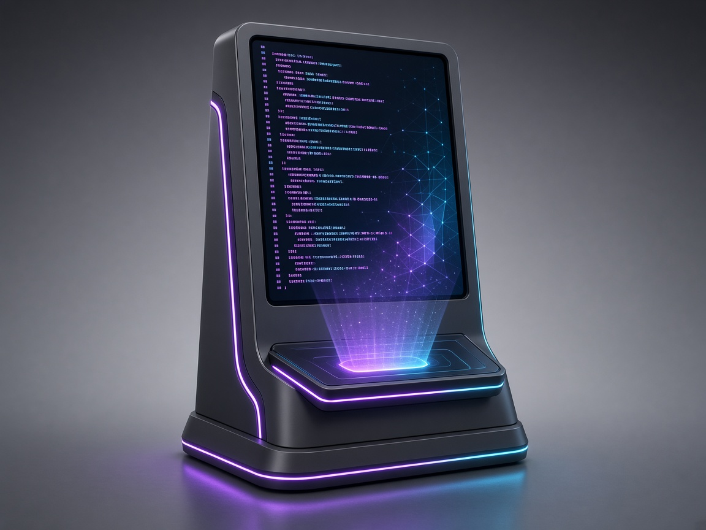

# CodeSensei

VR-ментор з об’єктно-орієнтованого програмування для лабораторії КПІ / MetaLab: термінал у VRChat і .NET API, який проксує Google Gemini.

Erasmus+ **NEXT** Student Creative Project Competition · КПІ ім. Ігоря Сікорського

[Демо /paste](https://codesensei-d5zi.onrender.com/paste) · [Health](https://codesensei-d5zi.onrender.com/health) · [Світ MetaLab](https://vrchat.com/home/world/wrld_b1c73436-f022-4f98-9172-671f9f0da989/info) · [Відео](presentation-materials/demo-video.mp4) · [Презентація](presentation-materials/CodeSensei-NEXT-presentation.pptx)

<p align="center">
  
</p>

Парний проєкт простору: **[MetaLab](https://github.com/mamenkomarkus-creator/MetaLab-NEXT)** — віртуальна зала MacPaw AI Lab. CodeSensei — AI-ментор, який стоїть у цій залі.

## Короткий опис

Студент у VR натискає пресет з ООП або запускає код-рев’ю. Термінал показує 5-символьний код; фрагмент коду надсилається з телефона чи ноута на `/paste`. За кілька секунд відповідь ментора з’являється на спільному екрані в VRChat.

Бекенд тримає ключ LLM на сервері. Клієнт VRChat ходить лише GET-запитами (`VRCStringDownloader`), бо Udon не вміє POST.

## Склад команди

| Ім’я | Роль |
| --- | --- |
| **Маменко Марк** | Team lead · backend (.NET, Gemini, Render) |
| Шозда Катерина | Learning design · пресети ООП, промпти ментора |
| Ільєнко Денис | QA · тести, контракт API, чекліст демо |
| Павленко Святослав | VRChat-клієнт · UdonSharp, префаб термінала |
| Пошитнюк Дмитро | Збірка світу MetaLab · VRChat SDK, розміщення на сцені |

Детальніше: [AUTHORS.md](AUTHORS.md)

## Як використовувати

### У VRChat (демо)

1. Відкрийте [health](https://codesensei-d5zi.onrender.com/health), щоб розбудити Free-інстанс Render (~30–50 с).
2. Зайдіть у [світ MetaLab](https://vrchat.com/home/world/wrld_b1c73436-f022-4f98-9172-671f9f0da989/info).
3. У VRChat: **Settings → Security → Allow Untrusted URLs**.
4. Натисніть пресет (наприклад «Інкапсуляція») — на терміналі з’являться рядки.
5. Натисніть **Код-рев’ю**. Термінал покаже код на кшталт `7K3MP`.
6. На телефоні відкрийте [paste](https://codesensei-d5zi.onrender.com/paste), введіть цей код і фрагмент C#.
7. За 10–40 с термінал друкує рев’ю (Помилки / ООП / Підказка).

Якщо на екрані `Not trusted url hit` — не ввімкнено Untrusted URLs. Якщо «немає з’єднання» після першого запиту — інстанс ще спав; повторіть після `/health`.

### Імпорт термінала в Unity

Інструкція: [`client/README.md`](client/README.md). Пакет: `client/CodeSensei.unitypackage`.

### Локальний запуск API

```bash
cp .env.example .env   # впишіть Gemini__ApiKey
dotnet test
dotnet run --project src/WebApi
```

API: http://localhost:5001  
Токен клієнта: `secret123` (як у префабі). Файл `.env` не комітити.

HTTP-контракт: [`docs/api.md`](docs/api.md).

## Результати

- Живий бекенд на Render: https://codesensei-d5zi.onrender.com
- 24 пресети ООП і код-рев’ю під GET-only клієнт VRChat
- Unity-пакет термінала для світу MetaLab
- Модульні тести: `dotnet test`
- Презентація, документація та спільне демо-відео: [`presentation-materials/`](presentation-materials/)

## Вміст репозиторію

```
src/                  бекенд (Domain, Application, Infrastructure, WebApi)
tests/UnitTests       NUnit
client/               UdonSharp + CodeSensei.unitypackage
docs/api.md           HTTP-контракт
presentation-materials/  презентація, документація, відео
```

---

# English

**CodeSensei** is an OOP mentor for the KPI / MetaLab virtual classroom: a VRChat terminal plus a .NET API that proxies Google Gemini.

[Paste demo](https://codesensei-d5zi.onrender.com/paste) · [Health](https://codesensei-d5zi.onrender.com/health) · [MetaLab world](https://vrchat.com/home/world/wrld_b1c73436-f022-4f98-9172-671f9f0da989/info) · [Demo video](presentation-materials/demo-video.mp4) · [Slides](presentation-materials/CodeSensei-NEXT-presentation.pptx)

Paired space project: **[MetaLab](https://github.com/mamenkomarkus-creator/MetaLab-NEXT)**.

### Team

| Name | Role |
| --- | --- |
| **Mark Mamenko** | Team lead · backend (.NET, Gemini, Render) |
| Kateryna Shozda | Learning design · OOP presets, mentor prompts |
| Denys Ilienko | QA · tests, API contract, demo checklist |
| Sviatoslav Pavlenko | VRChat client · UdonSharp terminal prefab |
| Dmytro Poshytyniuk | MetaLab world assembly · VRChat SDK |

### How to use

Wake https://codesensei-d5zi.onrender.com/health, join the MetaLab world, enable **Allow Untrusted URLs**, press an OOP preset or **Code review**. Enter the 5-character ticket on `/paste`. Import the prefab via [`client/README.md`](client/README.md). Local API: `dotnet run --project src/WebApi`.

### Results

Live Render backend, 24 OOP presets, Unity terminal package, NUnit tests, and contest materials (slides, docs, shared demo video) in [`presentation-materials/`](presentation-materials/).
