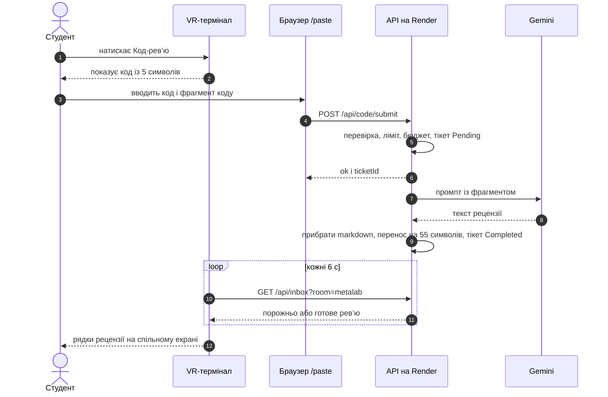
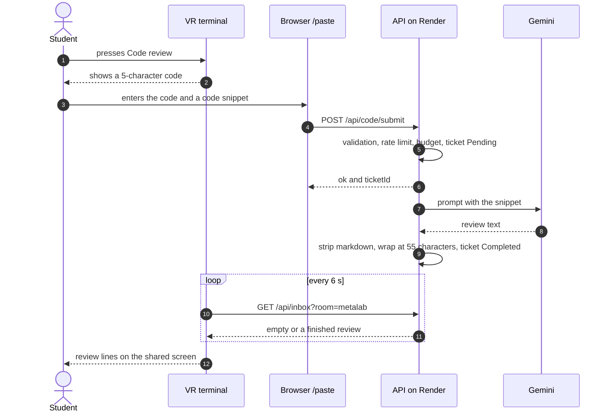

# CodeSensei: AI-ментор з об’єктно-орієнтованого програмування у віртуальній лабораторії VRChat

**Команда KP_Devs** · проєкт CodeSensei  
Erasmus+ NEXT Student Creative Project Competition · КПІ ім. Ігоря Сікорського  
Тімлід: Маменко Марк · парна зала: [MetaLab](https://github.com/mamenkomarkus-creator/MetaLab-NEXT) (команда Bilka)

Версія документа: 2026-10-08 · ревізія коду: `548b4c2` · дата вимірювань: 2026-10-07 (UTC)

Світ: https://vrchat.com/home/world/wrld_b1c73436-f022-4f98-9172-671f9f0da989/info  
API: https://codesensei-d5zi.onrender.com · вставка коду: [`/paste`](https://codesensei-d5zi.onrender.com/paste) · стан сервера: [`/health`](https://codesensei-d5zi.onrender.com/health)

**Ключові слова:** VRChat, UdonSharp, велика мовна модель, навчання програмування, ООП, код-рев’ю.

## 1. Анотація

У віртуальній лабораторії студент не має зручного способу отримати пояснення з об’єктно-орієнтованого програмування (ООП) або відгук на власний код так, щоб відповідь бачила вся група. Платформа VRChat ускладнює задачу: скрипти Udon завантажують рядок за URL не частіше ніж раз на п’ять секунд, а надіслати довільний текст зі світу не можна.

Ми розробили ментора, що працює всередині залі MetaLab. Клієнт UdonSharp показує текст на спільному екрані й ставить запити. Відповіді готує сервер-проксі на C# / .NET 10 з моделлю Google Gemini, тож ключ моделі не потрапляє у світ. Код-рев’ю розділено на два кроки: термінал показує 5-символьний код, а фрагмент студент вставляє на веб-сторінці `/paste`.

Реалізовано каталог із 24 тем ООП і код-рев’ю. Верифікація: 36 модульних тестів NUnit проходять, покриття рядків 90,5 %. Затримка пресета на живому API: p50 = 282 мс, p95 = 315 мс (n = 30). Затримку й якість код-рев’ю на момент вимірювання оцінити не вдалося, бо на сервері не був налаштований ключ моделі; набір із 10 фрагментів і скрипти для повтору наведено в розділі 3.5.

## 2. Вступ

### 2.1 Платформа і стек

Клієнт зібрано у **VRChat SDK3 Worlds** мовою **UdonSharp (C#)**. Мережа клієнта обмежена: світ завантажує рядки через `VRCStringDownloader` (HTTP GET), із мінімальним інтервалом між запитами [1]. Тому архітектура будується навколо GET-запитів і черги з паузою 5,5 с.

Сервер написано на **C# / .NET 10** (ASP.NET Minimal APIs) і розділено на шари Domain, Application, Infrastructure та WebApi. Збірка йде в Docker, хостинг — Render. Мовна модель — **Google Gemini**, назва за замовчуванням `gemini-flash-latest`. Провайдера моделі змінюють в одному класі (`LlmClient`), термінал у світі при цьому не змінюється.

Зала, де стоїть термінал, — окремий проєкт **MetaLab**: цифровий двійник лабораторії MacPaw AI Lab у КПІ. CodeSensei не моделює приміщення, а додає в готовий простір навчальну функцію: пояснення й рев’ю коду.

### 2.2 Мета і завдання

**Мета:** дати студентам у VR-залі доступ до AI-ментора з ООП, який відповідає на спільному екрані й не вимагає зберігати ключ моделі в клієнті.

**Завдання:**

1. Подати 24 теми ООП як короткі пояснення, що відкриваються однією кнопкою.
2. Реалізувати код-рев’ю фрагмента C# за умов платформи без POST із Udon.
3. Захистити ключ моделі й витрати: ключ лише на сервері, ліміт частоти запитів, денний бюджет.
4. Зробити систему перевірюваною: модульні тести, відтворювані заміри затримки, набір для оцінки якості рев’ю.

### 2.3 Команда

Команда з п’яти осіб. Бекенд і проксі — Маменко Марк. Навчальні тексти пресетів і промпт ментора — Шозда Катерина. Тести, контракт API і чекліст демо — Ільєнко Денис. Термінал UdonSharp — Павленко Святослав. Збірка світу і розміщення префаба — Пошитнюк Дмитро.

## 3. Практична частина

### 3.1 Архітектура

Код-рев’ю проходить через п’ять учасників: студента, термінал, браузер, API і модель. Послідовність показано на рис. 1.

*Рис. 1. Послідовність код-рев’ю. Кроки 1–2 відбуваються у VR; 3–6 — поза шоломом (браузер і сервер); 7–9 — обробка моделлю на сервері; 10–12 — опитування inbox і показ на спільному екрані.*

Обмеження платформи визначили ключові рішення. Їх зведено в таблиці 1.

*Таблиця 1. Обмеження платформи та відповідні рішення*

| Обмеження | Джерело | Рішення |
| --- | --- | --- |
| Один рядок кожні 5 с; зайві завантаження ставляться в чергу | документація VRChat [1] | Клієнт тримає чергу (до 8 запитів) з інтервалом не менше 5,5 с: значення нижче 5,5 у коді підтягується до 5,5 |
| Світ лише завантажує рядок за URL; відправлення тіла запиту в цьому API не описано | [1] | Пресети й inbox — GET. Код надсилається поза VR через `/paste` (POST) за 5-символьним квитком |
| Довірені домени: Disbridge, GitHub Pages, Gist, Pastebin, VRCDN; решта потребує «Allow Untrusted URLs» | [1] | Гравець вмикає налаштування у своєму клієнті й перезаходить; без цього клієнт отримує `Not trusted url` |
| Ключ моделі не можна зберігати в клієнті | вимога безпеки | Усі виклики моделі виконує сервер |
| Екран у VR вузький | дизайн | Форматер прибирає markdown і переносить рядки рев’ю на 55 символів; термінал показує 6 рядків на сторінку |
| Free-тариф Render засинає | хостинг | Ендпоінт `/health` і keep-alive (`ops/keep-render-awake.yml`) |

### 3.2 Що бачить студент

На столі в залі стоїть префаб `CodeSensei_Terminal` з кнопками тем, «Код-рев’ю», «Скасувати» і спільним екраном. Відповідь синхронізується між гравцями інстанса.

**Пресети.** 24 пояснення українською: інкапсуляція, наслідування, поліморфізм, абстракція, відмінність класу й об’єкта та інші. Кнопка викликає `GET /api/preset/{id}?k=…`. Кожен пресет — від 4 до 6 логічних рядків (у середньому 187 символів на тему). Сервер повертає їх без перенесення; термінал друкує по рядку з інтервалом 0,3 с.

**Код-рев’ю.** Термінал генерує код із п’яти символів (без 0, O, I та 1, щоб його було зручно диктувати в шоломі) і показує на екрані. Студент відкриває `/paste` на телефоні або ноутбуці, вводить код і вставляє фрагмент C#. Сторінка надсилає `POST /api/code/submit`. Термінал опитує `GET /api/inbox?room=metalab` кожні 6 с і друкує рев’ю, щойно з’являється запис із тим самим кодом. Таймаут очікування — 180 с.

**Формат відповіді.** Модель просять знайти помилки, назвати одну релевантну ідею ООП і дати одну підказку, не більше 8 рядків у структурі «Помилки / ООП / Підказка». Перед показом сервер прибирає markdown і переносить текст на межі слів так, щоб рядок не перевищував 55 символів.

### 3.3 Компоненти і параметри

*Таблиця 2. Компоненти системи*

| Частина | Роль |
| --- | --- |
| `CodeSenseiTerminal` | Стани очікування, квиток, синхронізація тексту між гравцями |
| `TerminalNetwork` | Черга GET-запитів з паузою під ліміт VRChat |
| `TerminalDisplay` | Постраничне виведення рядків на екран |
| `PresetButton` | Кнопка з прошитим URL пресета |
| `LlmClient` | Запит до Gemini, розбір відповіді, зрозумілі повідомлення про 429 і 5xx |
| `ReviewOrchestrator` | Промпт, форматування, запис результату в тікет |
| `TextFormatter` | Видалення markdown і перенос рядків на `Span`/`StringBuilder` |
| `InMemoryTicketStore` | Тікети в пам’яті процесу з TTL |
| `DailyBudgetGuard` | Облік денного бюджету викликів моделі |

*Таблиця 3. Параметри та ліміти*

| Параметр | Значення | Де задано |
| --- | --- | --- |
| Ліміт частоти | 60 запитів на хвилину з однієї IP-адреси | сервер |
| Максимальна довжина фрагмента | 3000 символів | сервер |
| Денний бюджет моделі | $2 (змінна `App__DailyBudgetUsd`) | сервер |
| Час життя тікета | 15 хв | сервер |
| Видимість готового рев’ю в inbox | 3 хв | сервер |
| Інтервал між GET-запитами клієнта | ≥ 5,5 с, черга до 8 | клієнт |
| Опитування inbox | кожні 6 с, таймаут 180 с | клієнт |
| Рядків на сторінку терміналу | 6 | клієнт |

Усі `/api/*`, крім `POST /api/code/submit`, вимагають токен клієнта (`?k=` або `X-Access-Token`), вшитий у префаб.

### 3.4 Середовище і версії

*Таблиця 4. Версії та середовище вимірювань*

| Компонент | Версія / значення |
| --- | --- |
| .NET SDK / цільова платформа | 10.0.400 / `net10.0` |
| Тестовий стек | NUnit 4.3.2, Microsoft.NET.Test.Sdk 17.14.0, NUnit3TestAdapter 5.0.0, coverlet 6.0.4 |
| Модель | `gemini-flash-latest` (рухомий псевдонім, див. нижче) |
| Хостинг | Render, безкоштовний тариф, Docker |
| Клієнт | Unity 2022.3.22f1, VRChat SDK Worlds 3.10.5 (середовище проєкту MetaLab) |
| Ревізія коду | `548b4c2`; сервер повертає її в `GET /health` |
| Дата вимірювань | 2026-10-07 (UTC) |

Назва `gemini-flash-latest` — псевдонім, який Google підміняє на новий реліз; про зміну версії за ним Google обіцяє попередження за два тижні [2]. Сервер не зберігає ні поле `modelVersion` відповіді, ні кількість токенів, тож точну версію моделі під час вимірювань зафіксувати неможливо. Для відтворюваності змінну `Gemini__Model` слід задавати конкретним кодом моделі (див. розділ 5).

### 3.5 Оцінювання та результати

Оцінювання охоплює чотири питання: чи коректна логіка (тести), чи швидко відповідає сервер, скільки це коштує і наскільки якісні рев’ю. Протокол і скрипти повторного запуску — в [`docs/evaluation/`](../../docs/evaluation/README.md). Усі числа нижче отримано вимірюванням 2026-10-07 (UTC); те, що виміряти не вдалося, винесено в таблицю 8.

**Верифікація.** *Таблиця 5. Модульні тести та покриття (ревізія `548b4c2`)*

| Показник | Значення |
| --- | --- |
| Тестів / пройдено / провалено | 36 / 36 / 0 |
| Тестових класів | 9 (квитки, бюджет, валідатори, форматер, промпт, оркестратор, клієнт моделі, каталог пресетів) |
| Покриття рядків | 90,5 % (522 з 577) |
| Покриття гілок | 84,8 % |
| Покриття за шарами | Domain 97,0 %, Application 94,0 %, Infrastructure 83,9 % |
| Розмір коду (непорожні рядки) | Domain 50, Application 401, Infrastructure 277, WebApi 386; тести 548 |

Шар WebApi (ендпоінти, сторінка `/paste`) модульними тестами не охоплений і не входить у наведене покриття.

**Затримка пресетів.** *Таблиця 6. Час відповіді `GET /api/preset/{id}` (n = 30, живий API, інстанс «прокинутий»)*

| p50 | p95 | мін. | макс. | середнє |
| --- | --- | --- | --- | --- |
| 282 мс | 315 мс | 255 мс | 715 мс | 297 мс |

Методика: 30 послідовних запитів `curl`, пресети 1–24 по колу, пауза 1,2 с; усі відповіді HTTP 200; точка вимірювання — Київ (вузол Cloudflare KBP). Перший запит `GET /health` повернувся за 342 мс. Сирі дані: [`preset-latency-2026-10-07.csv`](../../docs/evaluation/preset-latency-2026-10-07.csv). Серверний час (близько 0,3 с) на порядок менший за затримки клієнта: між запитами термінал чекає щонайменше 5,5 с, тож швидкість пресета у VR визначає платформа, а не сервер.

**Вартість (розрахункова).** Сервер не знає реальної кількості токенів, а оцінює витрати за формулою в `DailyBudgetGuard.EstimateUsd`: довжина фрагмента ÷ 4 токени на вході за $0,15 за мільйон і резерв 400 токенів на виході за $0,60 за мільйон (коефіцієнти задано в коді). *Таблиця 7. Розрахункова вартість рев’ю за формулою сервера*

| Фрагмент | Оцінка за запит | Запитів на добу при бюджеті $2 |
| --- | --- | --- |
| Набір із 10 фрагментів (106–266 символів, у середньому 152) | ≈ $0,00025 | ≈ 8 100 |
| Максимум дозволеної довжини (3000 символів) | ≈ $0,00035 | ≈ 5 700 |

Це оцінка, а не вимір: формула враховує довжину лише фрагмента, без шаблона промпта (близько 600 символів), і не бачить фактичних токенів відповіді. Реальну вартість можна встановити, лише додавши облік `usageMetadata` з відповіді моделі.

**Каталог пресетів.** Перевірено всі 24 теми: 4–6 рядків на тему (у середньому 4,1), 170–257 символів, найдовший рядок 81 символ. 19 із 24 пресетів містять рядки довші за 55 символів: перенесення на 55 символів сервер виконує лише для рев’ю, а пресети терміналу віддаються як є.

*Таблиця 8. Вимірювання, яких не отримано, і причини*

| Вимір | Стан на 2026-10-07 | Причина / що потрібно |
| --- | --- | --- |
| Затримка код-рев’ю (від `submit` до готового) | не виміряно | Прогін 10 фрагментів × 2 повтори: усі 20 відповідей — «LLM не налаштовано на сервері» (на інстансі немає `Gemini__ApiKey`). Після налаштування ключа повторити [`run_review_benchmark.py`](../../scripts/eval/run_review_benchmark.py) |
| Якість рев’ю: частка влучань, хибні спрацювання, формат | не виміряно | Те саме. Набір [`benchmark.json`](../../docs/evaluation/benchmark.json) і правила оцінювання підготовлено |
| Холодний старт Render Free | не виміряно | Потрібно 15+ хв без запитів до сервера; методика в `docs/evaluation/` |
| Юзабіліті (SUS) | не проводилось | Потрібні щонайменше 5 студентів; протокол і анкета в `docs/evaluation/` |

### 3.6 Як відтворити

1. Тести й покриття: `dotnet test --collect:"XPlat Code Coverage"` у корені репозиторію.
2. Затримка пресетів: `scripts/eval/measure_preset_latency.sh`.
3. Рев’ю: задати `Gemini__ApiKey`, потім `scripts/eval/run_review_benchmark.py` і `scripts/eval/summarize_review_benchmark.py`.
4. Демо у VRChat: відкрити `/health` і дочекатися відповіді; увімкнути **Settings → Security → Allow Untrusted URLs** і перезайти; натиснути пресет; натиснути «Код-рев’ю», відкрити `/paste`, надіслати короткий фрагмент C# і дочекатися тексту на терміналі.

Імпорт пакета в Unity: [`client/README.md`](../../client/README.md). HTTP-контракт: [`docs/api.md`](../../docs/api.md). Структура префаба: [`docs/prefab.md`](../../docs/prefab.md). Локальний запуск: скопіювати `.env.example` у `.env`, вписати `Gemini__ApiKey`, виконати `dotnet run --project src/WebApi`.

## 4. Труднощі та ліміти (загрози валідності)

**Платформа.** Зі світу неможливо надіслати текст, тому рев’ю є двокроковим і потребує пристрою поза шоломом. Домен Render не входить до довірених, тож кожен гравець вмикає «Allow Untrusted URLs» сам. Це обмеження платформи, а не тимчасовий обхід.

**Інфраструктура.** Безкоштовний інстанс Render засинає, і перший запит після паузи схожий на обрив зв’язку. Тікети живуть у пам’яті процесу й зникають після перезапуску, а ключ моделі задається вручну в панелі Render: якщо змінну не задано або її втрачено, рев’ю перестає працювати. Саме так було під час вимірювання.

**Внутрішня валідність вимірювань.** Затримку пресетів виміряно з однієї точки (Київ), на «прокинутому» інстансі, на вибірці 30 запитів; p95 за такого n є грубою оцінкою. Вартість розрахункова. Версію моделі не зафіксовано, бо `gemini-flash-latest` змінюється з часом.

**Зовнішня валідність.** Набір із 10 фрагментів демонстраційний і не репрезентує реальні роботи студентів. Оцінку влучання проводить одна людина, якщо не залучити другого оцінювача. Користувацького тестування зі студентами не було, тому твердження про зручність поки не підтверджене. Повний досвід розраховано на PC і PCVR; на Quest усе залежить від сцени MetaLab.

**Безпека і дані.** Токен клієнта (`secret123`) міститься в публічному репозиторії та префабі, тому він ідентифікує клієнта, але не є секретом. Реальний захист становлять ліміт 60 запитів на хвилину з IP і денний бюджет моделі. Фрагменти коду студентів надсилаються до Google Gemini; сховище тікетів тримає їх лише в пам’яті процесу впродовж часу життя тікета (15 хв); журнали сервера на предмет вмісту фрагментів не перевірялися.

**Інтерфейс.** Екран короткий, довгу відповідь доводиться скорочувати, тому промпт вимагає не більше 8 рядків. Пресети не переносяться сервером на 55 символів, їхнє відображення залежить від налаштувань текстового поля в Unity.

## 5. Подальший розвиток

1. Відновити `Gemini__ApiKey` на сервері й виконати прогін набору з розділу 3.5; додати результати до цього документа.
2. Фіксувати `modelVersion` і `usageMetadata` з відповіді моделі та задати конкретну версію моделі через `Gemini__Model`; тоді вартість і версію можна буде звітувати за фактом.
3. Провести тест юзабіліті зі студентами (SUS) і залучити другого оцінювача для якості рев’ю.
4. Постійне сховище тікетів, щоб рев’ю не зникало після перезапуску; стабільний keep-alive перед парами.
5. Інші мови програмування крім C#, більше тем у каталозі, промпт під конкретні лабораторні.
6. Перенесення пресетів через `TextFormatter`, щоб довжина рядка була однаковою для всіх відповідей.
7. Окрема оптимізація під Quest після того, як зала MetaLab вкладеться в бюджет мобільної платформи; публічна картка світу, коли термінал остаточно стоїть на сцені.

## Джерела

1. VRChat Creators. *String Loading*. https://creators.vrchat.com/worlds/udon/string-loading/ (дата звернення: 2026-10-07).
2. Google AI for Developers. *Gemini models*. https://ai.google.dev/gemini-api/docs/models (дата звернення: 2026-10-07).

---

# English

# CodeSensei: an AI mentor for object-oriented programming in a VRChat laboratory

**Team KP_Devs** · project CodeSensei  
Erasmus+ NEXT Student Creative Project Competition · Igor Sikorsky Kyiv Polytechnic Institute  
Team lead: **Mark Mamenko** · paired hall: [MetaLab](https://github.com/mamenkomarkus-creator/MetaLab-NEXT) (team Bilka)

Document version: 2026-10-08 · code revision: `548b4c2` · measurements taken: 2026-10-07 (UTC)

**Keywords:** VRChat, UdonSharp, large language model, programming education, OOP, code review.

## 1. Annotation

In a virtual laboratory a student has no convenient way to get an explanation of object-oriented programming (OOP), or feedback on their own code, so that the whole group sees the answer. VRChat adds constraints: Udon scripts can load a string from a URL no more often than once every five seconds, and a world cannot send arbitrary text out.

We built a mentor that works inside the MetaLab hall. A UdonSharp client shows text on a shared screen and issues requests. A C# / .NET 10 proxy server with Google Gemini produces the answers, so the model key never enters the world. Code review is split into two steps: the terminal shows a five-character code, and the student pastes the snippet on the `/paste` web page.

The system provides a catalogue of 24 OOP topics and code review. Verification: 36 NUnit unit tests pass, line coverage 90.5 %. Preset latency on the live API: p50 = 282 ms, p95 = 315 ms (n = 30). The latency and quality of code review could not be measured at the time because the model key was not configured on the server. A 10-snippet benchmark and the scripts to repeat the measurement are described in section 3.5.

## 2. Introduction

### 2.1 Platform and stack

The client is built with **VRChat SDK3 Worlds** and **UdonSharp (C#)**. Its networking is limited: a world loads strings through `VRCStringDownloader` (HTTP GET) with a minimum interval between requests [1]. The architecture is therefore built on GET requests and a queue with a 5.5 s pause.

The server is written in **C# / .NET 10** (ASP.NET Minimal APIs) with Domain, Application, Infrastructure, and WebApi layers. It is built with Docker and hosted on Render. The language model is **Google Gemini**, defaulting to `gemini-flash-latest`. Changing the model provider means changing one class (`LlmClient`); the in-world terminal stays the same.

The hall that holds the terminal is a separate project, **MetaLab**: a digital twin of the MacPaw AI Lab at KPI. CodeSensei does not model the room. It adds a teaching function to a finished space: topic explanations and code review.

### 2.2 Aim and objectives

**Aim:** give students in a VR hall access to an OOP mentor that answers on a shared screen and does not store the model key in the client.

**Objectives:**

1. Provide 24 OOP topics as short explanations opened with one button.
2. Implement review of a C# snippet under a platform that cannot POST from Udon.
3. Protect the model key and spending: the key stays on the server, with a request rate limit and a daily budget.
4. Make the system verifiable: unit tests, reproducible latency measurements, and a benchmark for review quality.

### 2.3 Team

A team of five. Backend and proxy: Mark Mamenko. Preset texts and the mentor prompt: Kateryna Shozda. Tests, API contract, and demo checklist: Denys Ilienko. UdonSharp terminal: Sviatoslav Pavlenko. World assembly and prefab placement: Dmytro Poshytyniuk.

## 3. Practical part

### 3.1 Architecture

A code review involves five participants: the student, the terminal, the browser, the API, and the model. Figure 1 shows the sequence.

*Figure 1. Code-review sequence. Steps 1–2 happen in VR; 3–6 outside the headset (browser and server); 7–9 are the model processing on the server; 10–12 are inbox polling and display on the shared screen.*

Platform constraints drove the key decisions. Table 1 summarises them.

*Table 1. Platform constraints and the corresponding decisions*

| Constraint | Source | Decision |
| --- | --- | --- |
| One string every 5 s; extra downloads are queued | VRChat documentation [1] | The client keeps a queue (up to 8 requests) with an interval of at least 5.5 s; values below 5.5 are raised to 5.5 in code |
| A world only downloads a string by URL; sending a request body is not described in this API | [1] | Presets and inbox use GET. Code is sent outside VR through `/paste` (POST) against a five-character ticket |
| Trusted domains: Disbridge, GitHub Pages, Gist, Pastebin, VRCDN; others need “Allow Untrusted URLs” | [1] | The player enables the setting in their own client and rejoins; otherwise the client receives `Not trusted url` |
| The model key must not live in the client | security requirement | The server makes every model call |
| The VR screen is narrow | design | The formatter strips markdown and wraps review lines at 55 characters; the terminal shows 6 lines per page |
| Render’s free tier sleeps | hosting | A `/health` endpoint and a keep-alive (`ops/keep-render-awake.yml`) |

### 3.2 What the student sees

A `CodeSensei_Terminal` prefab stands on a desk in the hall, with topic buttons, Code review, Cancel, and a shared display. The answer is synchronised between players in the instance.

**Presets.** 24 explanations in Ukrainian: encapsulation, inheritance, polymorphism, abstraction, class versus object, and others. A button calls `GET /api/preset/{id}?k=…`. Each preset is 4 to 6 logical lines (187 characters per topic on average). The server returns them without wrapping; the terminal prints one line every 0.3 s.

**Code review.** The terminal generates a five-character code (without 0, O, I, and 1, so it is easy to dictate in a headset) and displays it. The student opens `/paste` on a phone or laptop, enters the code, and pastes a C# snippet. The page sends `POST /api/code/submit`. The terminal polls `GET /api/inbox?room=metalab` every 6 s and prints the review as soon as an entry with the same code appears. The wait times out after 180 s.

**Answer format.** The model is asked to find errors, name one relevant OOP idea, and give one hint, in at most 8 lines with the structure “Errors / OOP / Hint”. Before display the server strips markdown and wraps the text at word boundaries so that no line exceeds 55 characters.

### 3.3 Components and parameters

*Table 2. System components*

| Part | Role |
| --- | --- |
| `CodeSenseiTerminal` | Waiting states, ticket, text synchronisation between players |
| `TerminalNetwork` | GET request queue paced to the VRChat limit |
| `TerminalDisplay` | Paged output of lines to the screen |
| `PresetButton` | A button with the preset URL baked in |
| `LlmClient` | Gemini request, response parsing, clear messages for 429 and 5xx |
| `ReviewOrchestrator` | Prompt, formatting, writing the result into the ticket |
| `TextFormatter` | Markdown removal and line wrapping on `Span`/`StringBuilder` |
| `InMemoryTicketStore` | In-process tickets with a TTL |
| `DailyBudgetGuard` | Accounting of the daily model budget |

*Table 3. Parameters and limits*

| Parameter | Value | Set in |
| --- | --- | --- |
| Rate limit | 60 requests per minute per IP address | server |
| Maximum snippet length | 3000 characters | server |
| Daily model budget | $2 (`App__DailyBudgetUsd`) | server |
| Ticket lifetime | 15 min | server |
| Time a finished review stays in the inbox | 3 min | server |
| Interval between client GET requests | ≥ 5.5 s, queue of 8 | client |
| Inbox polling | every 6 s, 180 s timeout | client |
| Lines per terminal page | 6 | client |

All `/api/*` endpoints except `POST /api/code/submit` require a client token (`?k=` or `X-Access-Token`) baked into the prefab.

### 3.4 Environment and versions

*Table 4. Versions and measurement environment*

| Component | Version / value |
| --- | --- |
| .NET SDK / target | 10.0.400 / `net10.0` |
| Test stack | NUnit 4.3.2, Microsoft.NET.Test.Sdk 17.14.0, NUnit3TestAdapter 5.0.0, coverlet 6.0.4 |
| Model | `gemini-flash-latest` (a moving alias, see below) |
| Hosting | Render, free tier, Docker |
| Client | Unity 2022.3.22f1, VRChat SDK Worlds 3.10.5 (the MetaLab project environment) |
| Code revision | `548b4c2`; the server returns it in `GET /health` |
| Measurement date | 2026-10-07 (UTC) |

`gemini-flash-latest` is an alias that Google swaps for each new release; Google promises two weeks’ notice before the version behind it changes [2]. The server stores neither the `modelVersion` field of the response nor the token counts, so the exact model version during measurements cannot be recorded. For reproducibility, `Gemini__Model` should be set to a specific model code (see section 5).

### 3.5 Evaluation and results

The evaluation addresses four questions: is the logic correct (tests), how fast does the server respond, what does it cost, and how good are the reviews. The protocol and scripts for repeating it are in [`docs/evaluation/`](../../docs/evaluation/README.md). All numbers below were measured on 2026-10-07 (UTC); what could not be measured is listed in Table 8.

**Verification.** *Table 5. Unit tests and coverage (revision `548b4c2`)*

| Indicator | Value |
| --- | --- |
| Tests / passed / failed | 36 / 36 / 0 |
| Test classes | 9 (tickets, budget, validators, formatter, prompt, orchestrator, model client, preset catalogue) |
| Line coverage | 90.5 % (522 of 577) |
| Branch coverage | 84.8 % |
| Coverage by layer | Domain 97.0 %, Application 94.0 %, Infrastructure 83.9 % |
| Code size (non-empty lines) | Domain 50, Application 401, Infrastructure 277, WebApi 386; tests 548 |

The WebApi layer (endpoints and the `/paste` page) has no unit tests and is not part of the coverage above.

**Preset latency.** *Table 6. Response time of `GET /api/preset/{id}` (n = 30, live API, instance awake)*

| p50 | p95 | min | max | mean |
| --- | --- | --- | --- | --- |
| 282 ms | 315 ms | 255 ms | 715 ms | 297 ms |

Method: 30 sequential `curl` requests, presets 1–24 in rotation, 1.2 s pause; all responses were HTTP 200; the vantage point was Kyiv (Cloudflare node KBP). The first `GET /health` returned in 342 ms. Raw data: [`preset-latency-2026-10-07.csv`](../../docs/evaluation/preset-latency-2026-10-07.csv). The server time (about 0.3 s) is an order of magnitude below the client delays: the terminal waits at least 5.5 s between requests, so in VR the speed of a preset is set by the platform, not the server.

**Cost (estimated).** The server does not know the real token counts. It estimates spending with the formula in `DailyBudgetGuard.EstimateUsd`: snippet length ÷ 4 input tokens at $0.15 per million, plus a reserve of 400 output tokens at $0.60 per million (the coefficients are set in code). *Table 7. Estimated review cost by the server formula*

| Snippet | Estimate per request | Requests per day at a $2 budget |
| --- | --- | --- |
| The 10-snippet benchmark (106–266 characters, mean 152) | ≈ $0.00025 | ≈ 8,100 |
| Maximum allowed length (3000 characters) | ≈ $0.00035 | ≈ 5,700 |

This is an estimate, not a measurement: the formula counts only the snippet length, without the prompt template (about 600 characters), and does not see the actual output tokens. The real cost can only be established by logging `usageMetadata` from the model response.

**Preset catalogue.** All 24 topics were checked: 4–6 lines per topic (4.1 on average), 170–257 characters, longest line 81 characters. 19 of the 24 presets contain lines longer than 55 characters: the server wraps at 55 characters only for reviews, and presets reach the terminal as they are.

*Table 8. Measurements not obtained, and why*

| Measurement | Status on 2026-10-07 | Reason / what is needed |
| --- | --- | --- |
| Code-review latency (`submit` to ready) | not measured | A run of 10 snippets × 2 repeats: all 20 responses were “LLM is not configured on the server” (`Gemini__ApiKey` is absent on the instance). After the key is set, repeat [`run_review_benchmark.py`](../../scripts/eval/run_review_benchmark.py) |
| Review quality: hit rate, false alarms, format | not measured | Same. The [`benchmark.json`](../../docs/evaluation/benchmark.json) set and the scoring rules are ready |
| Render Free cold start | not measured | Needs 15+ min without requests to the server; method in `docs/evaluation/` |
| Usability (SUS) | not conducted | At least 5 students are needed; the protocol and questionnaire are in `docs/evaluation/` |

### 3.6 How to reproduce

1. Tests and coverage: `dotnet test --collect:"XPlat Code Coverage"` in the repository root.
2. Preset latency: `scripts/eval/measure_preset_latency.sh`.
3. Review: set `Gemini__ApiKey`, then run `scripts/eval/run_review_benchmark.py` and `scripts/eval/summarize_review_benchmark.py`.
4. Demo in VRChat: open `/health` and wait for the response; enable **Settings → Security → Allow Untrusted URLs** and rejoin; press a preset; press Code review, open `/paste`, submit a short C# snippet, and wait for the text on the terminal.

Importing the package into Unity: [`client/README.md`](../../client/README.md). HTTP contract: [`docs/api.md`](../../docs/api.md). Prefab structure: [`docs/prefab.md`](../../docs/prefab.md). Local run: copy `.env.example` to `.env`, set `Gemini__ApiKey`, and run `dotnet run --project src/WebApi`.

## 4. Difficulties and limits (threats to validity)

**Platform.** A world cannot send text out, so review takes two steps and needs a device outside the headset. The Render domain is not on the trusted list, so each player enables “Allow Untrusted URLs” themselves. This is a platform constraint, not a temporary workaround.

**Infrastructure.** The free Render instance sleeps, and the first request after a pause looks like a dropped connection. Tickets live in process memory and vanish on restart, and the model key is entered manually in the Render dashboard: if the variable is missing or lost, review stops working. That was the situation during the measurement.

**Internal validity of the measurements.** Preset latency was measured from one location (Kyiv), on an awake instance, with a sample of 30 requests; p95 at this n is a rough estimate. Cost is estimated. The model version is not recorded because `gemini-flash-latest` changes over time.

**External validity.** The 10-snippet set is a demonstration and does not represent real student work. One person scores hit rate unless a second rater is added. There was no user testing with students, so the claim about usability is not yet supported. The full experience targets PC and PCVR; on Quest everything depends on the MetaLab scene.

**Security and data.** The client token (`secret123`) is in the public repository and the prefab, so it identifies the client but is not a secret. The actual protection is the limit of 60 requests per minute per IP and the daily model budget. Students’ code snippets are sent to Google Gemini; the ticket store keeps them only in process memory for the ticket lifetime (15 min); the server logs were not checked for snippet contents.

**Interface.** The screen is short and a long answer has to be shortened, so the prompt asks for at most 8 lines. The server does not wrap presets at 55 characters, so how they appear depends on the text field settings in Unity.

## 5. Further development

1. Restore `Gemini__ApiKey` on the server and run the benchmark from section 3.5; add the results to this document.
2. Record `modelVersion` and `usageMetadata` from the model response and pin a specific model through `Gemini__Model`; then cost and version can be reported as measured values.
3. Run a usability test with students (SUS) and add a second rater for review quality.
4. A persistent ticket store so reviews survive a restart; a reliable keep-alive before classes.
5. Languages other than C#, more topics in the catalogue, and a prompt tuned to specific lab sessions.
6. Pass presets through `TextFormatter` so line length is the same for every answer.
7. A separate Quest optimisation once the MetaLab hall fits the mobile budget; a public world listing once the terminal stays on the scene.

## References

1. VRChat Creators. *String Loading*. https://creators.vrchat.com/worlds/udon/string-loading/ (accessed 2026-10-07).
2. Google AI for Developers. *Gemini models*. https://ai.google.dev/gemini-api/docs/models (accessed 2026-10-07).
